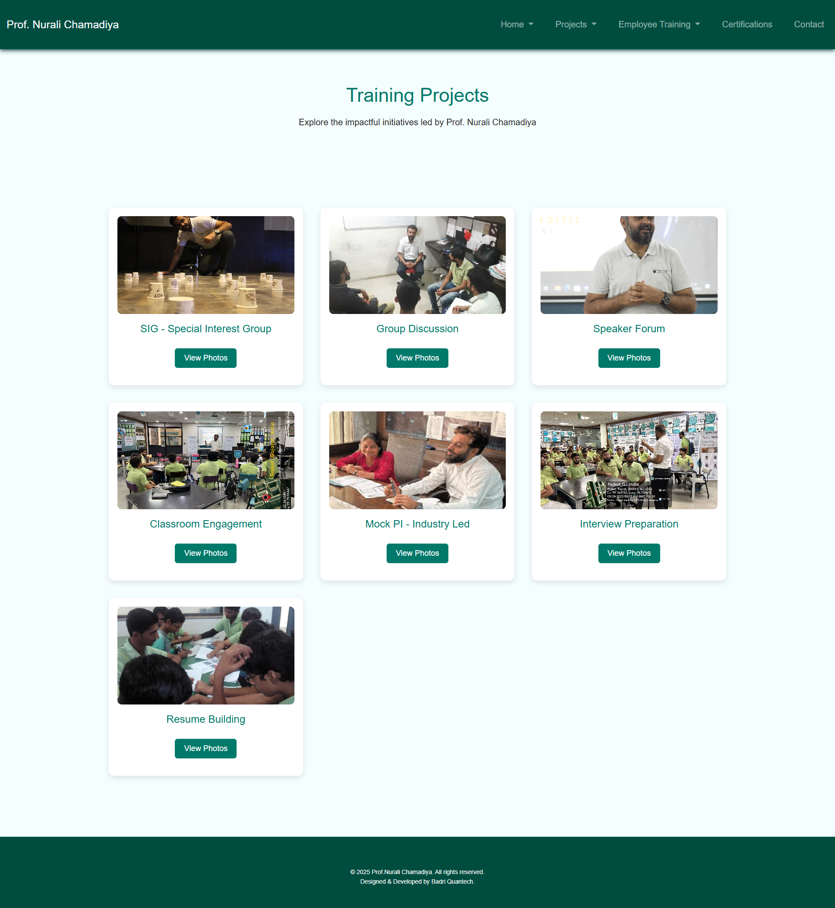
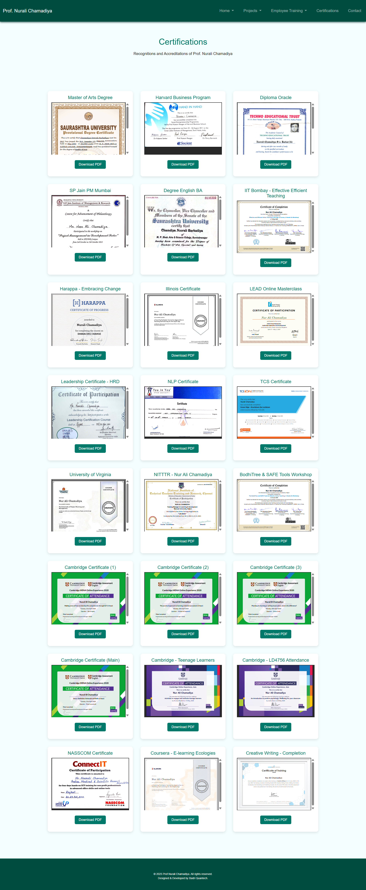
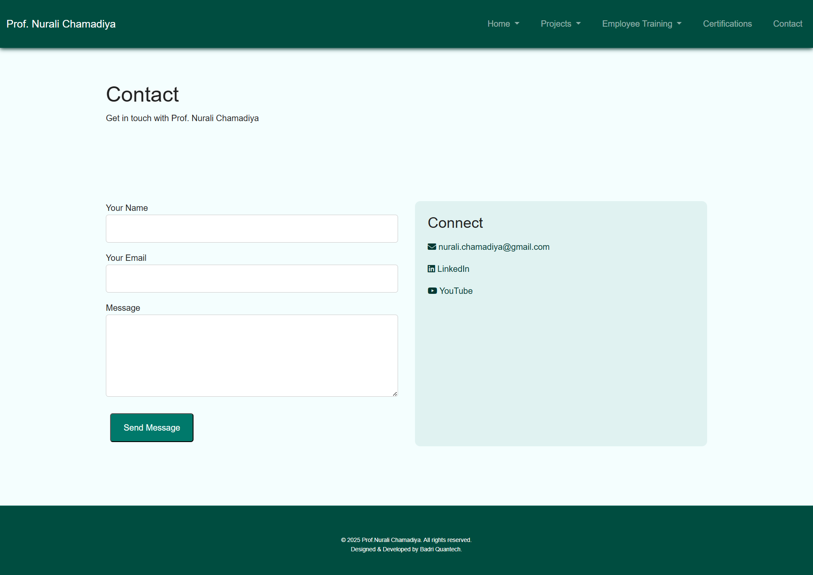

# Prof. Nurali Chamadiya - Portfolio Website 🌐  

A professional portfolio website designed and developed for **Prof. Nurali Chamadiya**, showcasing his academic achievements, professional journey, publications, and contributions.  
The website is currently live at: [nurali-chamadiya.netlify.app](https://nurali-chamadiya.netlify.app/) 🚀  

---

## 📖 About the Project  
This website serves as a **digital identity and portfolio** for Prof. Nurali Chamadiya. It highlights his work in education, research, publications, and professional activities, providing students, peers, and collaborators with easy access to his profile.  

The website is lightweight, responsive, and optimized for both desktop and mobile devices.  

---

## ✨ Features  
- 📌 **Responsive Design** – Works seamlessly across devices.  
- 🎓 **Academic Portfolio** – Highlights education, publications, and achievements.  
- 📂 **Projects & Contributions** – Organized showcase of professional work.  
- 📸 **Gallery Section** – Visual showcase of events and seminars.  
- 📬 **Contact Section** – Easy communication channel.  
- 🌍 **SEO Optimized** – Indexed and discoverable on search engines.  

---

## 🛠️ Tech Stack  
- **Frontend:** HTML, CSS, JavaScript  
- **UI Framework:** Bootstrap  
- **Hosting:** Netlify (initial stage, later to be migrated to a custom domain)  
- **Version Control:** Git & GitHub  

---

## 📷 Screenshots  

- **Homepage**  
    

- **Projects Section**  
    

- **Event Details Section**  
    

- **Certifications Section**  
    

- **Contact Section**  
    

---

## 🚀 Deployment  
The project is deployed using **Netlify**.  

🔗 Live Demo: [https://nurali-chamadiya.netlify.app/](https://nurali-chamadiya.netlify.app/) 
 
To run locally:  
```bash

# Clone the repository
git clone https://github.com/mercyless22/Nurali-Chamadiya.git

# Navigate into the project folder
cd nurali-chamadiya-portfolio

# Open index.html in your browser
````

---

## 📌 Future Scope

* ✅ Migration to **custom domain**.
* ✅ Addition of **dynamic blog section** to share research insights & updates.
* ✅ Integration with a **CMS (WordPress/Headless CMS)** for easier content management.
* ✅ Advanced **SEO optimization** with meta tags, schema markup, and analytics.
* ✅ Addition of **animations & transitions** for a modern UI feel.
* ✅ Accessibility improvements (WCAG standards compliance).
* ✅ Contact form integration with **Email/Google Sheets backend**.
* ✅ Option for **multi-language support** (English + regional languages).

---

## 🤝 Credits

* **Website Owner:** Prof. Nurali Chamadiya
* **Design & Development:** Taher M Travadi

---

## 📜 License

This project is licensed under the **MIT License** – free to use and modify with attribution.

---

⭐️ Developed by [Taher M Travadi](https://github.com/mercyless22) with ❤️
